# ASP.NET Web Site development with VB.NET 4.8

This guide is for teams maintaining ASP.NET **Web Site** applications that:

- run on .NET Framework 4.8;
- use VB.NET page or handler code-behind without a Visual Studio build;
- rely on dynamic compilation through application-root `App_Code`;
- deploy source files directly to IIS, often through a mapped drive;
- keep the authoritative source in a local Git repository.

The examples are intentionally repository- and client-neutral. Replace paths,
URLs, assembly names, and exclusions with values appropriate to each site.

## Web Site versus Web Application

ASP.NET Framework supports two materially different project models.

| Model | Compilation model |
| --- | --- |
| **Web Site** | IIS/ASP.NET dynamically compiles pages, handlers, code-behind, and application-root `App_Code` source. A project file and Visual Studio build are not required. |
| **Web Application** | Visual Studio, MSBuild, or another build process compiles code-behind and application source into assemblies deployed under `bin`. |

This guide covers the **Web Site** model. The CLR still runs assemblies, but
ASP.NET creates those assemblies dynamically from deployed source.

## Where server code can live

### Page-local code-behind

A Web Site page can compile a source file beside the page by using `CodeFile`:

```aspx
<%@ Page Language="VB"
    AutoEventWireup="false"
    CodeFile="Default.aspx.vb"
    Inherits="DefaultPage" %>
```

```vb
Imports System
Imports System.Web.UI

Partial Public Class DefaultPage
    Inherits Page

    Protected Overrides Sub OnLoad(e As EventArgs)
        MyBase.OnLoad(e)
    End Sub
End Class
```

The same pattern works for handlers:

```aspx
<%@ WebHandler Language="VB"
    CodeFile="status.ashx.vb"
    Class="StatusHandler" %>
```

```vb
Imports System.Web

Public Class StatusHandler
    Implements IHttpHandler

    Public Sub ProcessRequest(context As HttpContext) Implements IHttpHandler.ProcessRequest
        context.Response.ContentType = "application/json"
        context.Response.Write("{""ok"":true}")
    End Sub

    Public ReadOnly Property IsReusable As Boolean Implements IHttpHandler.IsReusable
        Get
            Return False
        End Get
    End Property
End Class
```

Master pages and user controls support equivalent `CodeFile` directives.

For dynamically compiled Web Sites, use `CodeFile`, not `CodeBehind`.
`CodeBehind` is primarily a Web Application/IDE association and does not tell
the Web Site build manager to compile a loose source file.

### Application-root App_Code

The application-root `App_Code` directory is ASP.NET's application-wide dynamic
source compilation root. Public types compiled there are available to pages,
handlers, code-behind, and other `App_Code` source in the same application.

A useful organization is:

```text
App_Code/
  Shared/
    DataConversion.vb
    ServiceExceptions.vb
  CustomerSearch/
    CustomerContracts.vb
    CustomerRepository.vb
    CustomerService.vb
  OrderAdmin/
    OrderContracts.vb
    OrderRepository.vb
    OrderService.vb
```

Use page-local `CodeFile` for page lifecycle or request adapter code that is
owned by one endpoint. Use `App_Code/<Feature>/` for reusable feature contracts,
validation, services, repositories, and API helpers. Use `App_Code/Shared/` for
behavior genuinely shared across features.

### Compiled assemblies

Already compiled dependencies can live under application-root `bin` or, less
commonly, in the machine GAC. The GAC should generally be reserved for genuine
machine-wide platform dependencies, not feature-specific application code.

### What does not work

VB `Imports` imports a namespace; it does not include another source file.
Loose `.vb` files in arbitrary folders are not application-wide libraries unless
ASP.NET includes them in a page/control `CodeFile` compilation unit or in
application-root `App_Code`.

An HTTP call to an `.ashx`, `.aspx`, or external API is another valid boundary,
but it is a service call rather than a source reference. It introduces request
serialization, authentication propagation, latency, and failure handling.

## Proven App_Code nested-folder behavior

For a Web Site using the default compilation configuration:

- application-root `App_Code` is special;
- ordinary nested folders containing the same language participate in the
  generated `App_Code` assembly;
- types in a parent folder can reference nested-folder types;
- nested-folder types can reference parent-folder types.

This behavior was verified using the .NET Framework `aspnet_compiler.exe` and a
real IIS-hosted Web Site.

### Important boundaries

1. The special directory is the **application-root** `App_Code`. A folder such
   as `features/Example/App_Code` is not a compilation root unless `features/Example`
   is itself an IIS application.
2. An explicit `<codeSubDirectories>` configuration changes compilation units
   and can affect cross-folder dependency direction.
3. Mixed-language source requires separate compilation units or assemblies.
   Do not assume C# and VB files can be placed together in one default
   `App_Code` compilation.
4. A nested IIS application has its own application root, configuration, `bin`,
   session/authentication boundary, and `App_Code` behavior.

### Reproducible nesting proof

Create a disposable site:

```text
NestingProbe/
  Default.aspx
  web.config
  App_Code/
    RootProbe.vb
    Feature/
      NestedProbe.vb
```

`web.config`:

```xml
<?xml version="1.0"?>
<configuration>
  <system.web>
    <compilation debug="false" targetFramework="4.8" />
    <httpRuntime targetFramework="4.8" />
  </system.web>
</configuration>
```

`App_Code/RootProbe.vb`:

```vb
Public NotInheritable Class RootProbe
    Private Sub New()
    End Sub

    Public Shared Function ReadNested() As String
        Return NestedProbe.ReadRoot()
    End Function

    Public Shared Function RootValue() As String
        Return "root"
    End Function
End Class
```

`App_Code/Feature/NestedProbe.vb`:

```vb
Public NotInheritable Class NestedProbe
    Private Sub New()
    End Sub

    Public Shared Function ReadRoot() As String
        Return RootProbe.RootValue() & ":nested"
    End Function
End Class
```

`Default.aspx`:

```aspx
<%@ Page Language="VB" %>
<!doctype html>
<html>
<body><%= RootProbe.ReadNested() %></body>
</html>
```

Compile it with ASP.NET's Web Site compiler:

```powershell
$framework = "$env:WINDIR\Microsoft.NET\Framework64\v4.0.30319"
$site = 'C:\Work\NestingProbe'
$output = Join-Path $env:TEMP 'NestingProbe-precompiled'

if (Test-Path -LiteralPath $output) {
    Remove-Item -LiteralPath $output -Recurse -Force
}

& "$framework\aspnet_compiler.exe" `
    -nologo `
    -v / `
    -p $site `
    $output

exit $LASTEXITCODE
```

A successful compile proves the two-way parent/nested references under that
configuration. The generated output normally includes `bin/App_Code.dll`.

Before relying on this result for an existing site, check its effective
`web.config` hierarchy for `codeSubDirectories` and confirm all nested source is
the same language.

## Recommended local and deployment layout

Keep the Git repository on a local disk and the IIS deployment separate:

```text
C:\Work\WebSites\
  ExampleSite\              # local Git repository and source of truth
  ExampleSite-reference\    # optional local snapshot/reference, not deployed

S:\Sites\ExampleSite\      # mapped IIS deployment, not a Git worktree
```

The two local folders are siblings so a server snapshot, migration reference,
or generated comparison data cannot accidentally become part of the Git
repository. The optional reference folder should be read-only in normal work.

Do not put `.git` in the mapped IIS deployment. Network latency, Git safety
configuration, server-only edits, and runtime-generated files make it a poor
working tree.

## Workstation prerequisites

Install or confirm:

- Git for Windows;
- .NET Framework 4.8 and its Developer Pack/targeting pack;
- access to the development deployment share;
- local copies of non-framework assemblies needed for compilation;
- Node.js only when the site has JavaScript tests or build tooling.

The .NET Framework 4.x command-line tools remain in a directory named
`v4.0.30319`:

```powershell
$framework64 = "$env:WINDIR\Microsoft.NET\Framework64\v4.0.30319"
$framework32 = "$env:WINDIR\Microsoft.NET\Framework\v4.0.30319"

Test-Path -LiteralPath (Join-Path $framework64 'vbc.exe')
Test-Path -LiteralPath (Join-Path $framework64 'aspnet_compiler.exe')
```

Use the toolset matching the IIS application pool when bitness matters. A
64-bit compile is usually appropriate for AnyCPU managed source. Use the
32-bit toolset when the application depends on 32-bit-only providers or native
assemblies. Compilation does not prove that a database provider or COM/native
dependency can load under the IIS identity, so those integrations still require
runtime verification on the development server.

## Creating the local Git repository

### Existing GitHub repository

```powershell
$workspace = 'C:\Work\WebSites'
$repo = Join-Path $workspace 'ExampleSite'

New-Item -ItemType Directory -Path $workspace -Force | Out-Null
git clone https://github.com/ORGANIZATION/REPOSITORY.git $repo
Set-Location $repo
git status
```

### Importing an existing deployed Web Site

Prefer creating an empty private GitHub repository, cloning it locally, and
then importing a reviewed source set. Do not initialize Git directly on the
server share.

```powershell
$repo = 'C:\Work\WebSites\ExampleSite'
$deployment = 'S:\Sites\ExampleSite'

# Preview first. Robocopy exit codes 0-7 are nonfatal success states.
robocopy $deployment $repo /E /L `
    /XD bin obj .vs App_Data\logs uploads temp .history `
    /XF web.config.local *.user *.suo *.log
$previewExit = $LASTEXITCODE
if ($previewExit -gt 7) {
    exit $previewExit
}
```

After reviewing the preview, remove `/L` to copy. Do not use `/MIR` for an
initial import; it can delete files from the destination.

Create a site-specific `.gitignore`. Typical starting points are:

```gitignore
.vs/
obj/
*.user
*.suo
*.log
.history/
Temporary ASP.NET Files/

# Runtime or environment-specific content; tailor these to the site.
App_Data/logs/
uploads/
temp/
web.config.local
*.secrets.config
```

Do not blindly ignore all of `bin`. Some legacy Web Sites depend on third-party
assemblies that are not available through a package manager. Decide explicitly
whether each assembly is restored from a package/feed, retained in Git where
licensing permits, or supplied through a documented local dependency process.

Before the first commit:

```powershell
Set-Location $repo
git status --short
git diff --check
git add -A
git diff --cached --check
git diff --cached --name-status
```

Review staged configuration and binaries for credentials, connection strings,
private keys, certificates, tokens, and environment-specific settings before
committing or pushing.

## Source-first development workflow

```mermaid
flowchart LR
    Compare[Compare local source and deployment] --> Edit[Edit local Git source]
    Edit --> Focused[Run focused tests]
    Focused --> Compile[Compile locally]
    Compile --> Backup[Back up deployed files]
    Backup --> Deploy[Deploy coordinated set]
    Deploy --> Hash[Verify hashes and inventory]
    Hash --> IIS[Test through remote IIS]
    IIS --> Commit[Commit and push]
```



### 1. Compare before editing

```powershell
Set-Location 'C:\Work\WebSites\ExampleSite'
git status --short
git diff --check
```

If staff edited the deployment directly, compare it with the local repository
before the next deployment. Reapply the intended server change locally, test
it, and redeploy from the repository.

### 2. Edit local source

Edit only the local Git repository. Avoid editor-driven changes to deployed
`App_Code`: editor history tools can create hidden source copies that ASP.NET
may compile as duplicate classes.

### 3. Run focused tests

Test the smallest affected behavior first. Keep pure validation, service, and
state tests independent of IIS where practical.

For VB tests, compile a console executable with a `Sub Main` test module and the
smallest required production source set. Always preflight source and reference
paths before interpreting compiler output.

### 4. Compile the server source locally

There are two useful compile levels.

#### Fast VB source compile

A recursive `vbc.exe` compile catches syntax, duplicate declarations, and most
cross-file type errors quickly:

```powershell
$repo = 'C:\Work\WebSites\ExampleSite'
$framework = "$env:WINDIR\Microsoft.NET\Framework64\v4.0.30319"
$compiler = Join-Path $framework 'vbc.exe'

Set-Location $repo
$sources = @(
    Get-ChildItem -LiteralPath (Join-Path $repo 'App_Code') `
        -Filter '*.vb' -File -Recurse |
        Sort-Object FullName |
        Select-Object -ExpandProperty FullName
)

$references = @(
    'System.dll',
    'System.Core.dll',
    'System.Configuration.dll',
    'System.Data.dll',
    'System.Web.dll',
    'System.Web.Extensions.dll'
)

# Add site-specific assemblies, preferably from a documented local location.
$localAssemblies = @(
    # 'C:\Work\Dependencies\Vendor.Library.dll'
)

foreach ($path in @($compiler) + $sources + $localAssemblies) {
    if (-not (Test-Path -LiteralPath $path)) {
        Write-Error "Missing compile input: $path"
        exit 1
    }
}

$output = Join-Path $env:TEMP 'ExampleSite-AppCode-validation.dll'
$referenceArgument = '/reference:' + (($references + $localAssemblies) -join ',')

& $compiler /nologo /target:library "/out:$output" $referenceArgument $sources
exit $LASTEXITCODE
```

The Framework 4.x tools remain under the `v4.0.30319` directory even when the
site targets .NET Framework 4.8.

This compile is fast but does not reproduce every ASP.NET build-provider rule.

#### Authoritative Web Site precompile

Use `aspnet_compiler.exe` to exercise page directives, handler directives,
master pages, user controls, `App_Code`, and the Web Site compilation model:

```powershell
$repo = 'C:\Work\WebSites\ExampleSite'
$framework = "$env:WINDIR\Microsoft.NET\Framework64\v4.0.30319"
$compiler = Join-Path $framework 'aspnet_compiler.exe'
$output = Join-Path $env:TEMP 'ExampleSite-precompiled'

if (Test-Path -LiteralPath $output) {
    Remove-Item -LiteralPath $output -Recurse -Force
}

& $compiler -nologo -v / -p $repo $output
exit $LASTEXITCODE
```

If required assemblies or environment-specific configuration are intentionally
not versioned, create a temporary staging copy, supply the ignored local files
there, and precompile the staging site. Do not modify tracked source merely to
satisfy one workstation.

A missing source file, compiler, reference assembly, or output directory is a
command setup failure. Correct the command before concluding that source is
broken.

### 5. Back up and deploy a coordinated manifest

List every changed runtime file and every file to remove. Include page assets,
code-behind, `App_Code`, shared files, and cache-version owners.

Back up the current deployed versions to an ignored local temporary directory.
Then copy the complete validated set. Keep the backup until remote verification
passes.

Before changing deployed `App_Code`, check for editor-history source:

```powershell
$history = 'S:\Sites\ExampleSite\App_Code\.history'
if (Test-Path -LiteralPath $history) {
    Write-Error "Unexpected App_Code history directory: $history"
    exit 1
}
```

### 6. Verify source/deployment parity

```powershell
foreach ($pair in $deploymentPairs) {
    $sourceHash = (Get-FileHash -Algorithm SHA256 -LiteralPath $pair.Source).Hash
    $targetHash = (Get-FileHash -Algorithm SHA256 -LiteralPath $pair.Target).Hash

    if ($sourceHash -ne $targetHash) {
        Write-Error "Hash mismatch: $($pair.Target)"
        exit 1
    }
}
```

For moved or consolidated `App_Code` files, assert the exact expected inventory
and confirm old files are absent. Leaving both old and new declarations can
break the entire dynamically compiled application.

### 7. Verify through IIS

A successful file copy does not prove that IIS compiled or ran the change. Test
through the remote development URL:

- page load and authentication;
- `.aspx` and `.ashx` responses;
- expected status codes and JSON/HTML shapes;
- the changed workflow, including validation and cancelled destructive actions;
- desktop and mobile layout where applicable;
- referenced asset cache versions;
- absence of retired scripts or source files.

### 8. Complete or roll back

If verification passes:

1. repeat hash and inventory checks;
2. run `git diff --check`;
3. remove the temporary deployment backup;
4. commit and push according to team policy.

If verification fails:

1. restore the complete backup;
2. verify restoration hashes and inventory;
3. fix and retest locally;
4. redeploy the full coordinated set.

Do not debug for an extended period against a partially deployed application.

## Handling direct deployment edits

Direct server edits should be exceptional. If one occurs:

1. stop before deploying from Git;
2. diff the deployment and local source;
3. bring the intended change into the local repository;
4. run focused tests and local compilation;
5. deploy from local source and verify hashes.

This prevents the next deployment from silently erasing the server edit.

## Architecture guidance without compiled application DLLs

A maintainable Web Site can remain source-deployed without putting all behavior
in page code-behind:

```text
Feature page or handler
  -> thin request/page adapter
  -> App_Code/<Feature>/service
  -> App_Code/<Feature>/repository
  -> database or external system
```

Recommended boundaries:

- code-behind owns page lifecycle and request adaptation;
- handlers own HTTP method dispatch and response serialization;
- services own validation, authorization-sensitive business rules, and
  orchestration;
- repositories own parameterized database access and transactions;
- contracts contain DTOs and narrow interfaces;
- shared helpers are extracted only when two or more features genuinely use the
  same behavior.

Organize feature source into ordinary nested folders under application-root
`App_Code`. Confirm the site has no conflicting `codeSubDirectories`
configuration and preserve one language per compilation unit.

## Staff checklist

- [ ] Confirm the IIS application root and effective .NET Framework 4.8 configuration.
- [ ] Confirm whether the site is a Web Site or Web Application.
- [ ] Use `CodeFile` for dynamically compiled page/handler code-behind.
- [ ] Put reusable source under application-root `App_Code`.
- [ ] Check `codeSubDirectories` before relying on cross-folder references.
- [ ] Keep the Git repository on a local disk, separate from the deployment.
- [ ] Review and exclude secrets, logs, uploads, generated files, and runtime data.
- [ ] Run focused tests.
- [ ] Run recursive `vbc.exe` validation.
- [ ] Run `aspnet_compiler.exe` when page/build-provider behavior matters.
- [ ] Back up and deploy a coordinated manifest.
- [ ] Verify SHA-256 hashes and exact file inventory.
- [ ] Verify through remote IIS.
- [ ] Roll back the full set on failure.
- [ ] Commit and push only the validated local source.
