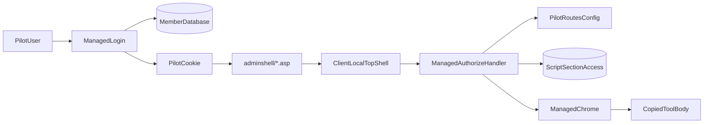

# Managed Admin Shell Plan

Last updated: July 17, 2026

The operational continuation notes are in
[`agent-handoff.md`](agent-handoff.md). A new agent should read that file before
editing the pilot.

## Safety boundary

All implementation work stays under:

`A:\wvbps\www\html\dev\adminshell`

Shared VB.NET classes are isolated by name and folder under:

`A:\wvbps\www\html\App_Code\AdminShell`

`A:\GLOBAL_6-next\admin` is read-only reference code. Editing global admin files
would affect other clients using that version.

The existing WVBPS login, tools, Perl routes, menu registrations, and
`/admin/admin` virtual application remain unchanged.

## Current status

Completed:

- Created a separate, unlinked WVBPS pilot.
- Added an allowlisted VB.NET login using the existing member database.
- Added a separate encrypted/signed `bp_admin_next` cookie containing no
  password.
- Added configuration-driven pilot route to canonical ACL mapping in
  `managed/web.config` (`PilotRoutes`, `PilotDefaultRoute`).
- Added managed header/footer rendering with navigation generated from the
  configured pilot routes.
- Added a Classic ASP bridge that authorizes before tool business logic runs.
- Copied global tools into the client pilot and changed only shell, include,
  title, and relative asset paths:
  - `views.asp`
  - `loginlog.asp`
  - `sql_logs.asp`
  - `sms_logs.asp`
- Replaced the Web Forms login and master-page scaffold with semantic HTML5,
  plain JavaScript, and a VB.NET JSON login API.
- Added an accessible show/hide-password control with an explicit label and
  pressed state for assistive technology.
- Added policy tests and a database/ACL smoke test.
- Moved shared pilot classes into the parent application's root `App_Code`.
- Removed child-only ASP.NET configuration sections so the managed pages run
  within the existing .NET Framework 4.8 front-end application.
- Verified that policy tests pass and the pilot tree has no IDE diagnostics
  for the Views wave; Wave 2 policy tests were updated for multi-route
  mapping and still need a remote compile/run pass.
- Added Unified Access Manager domain services under `App_Code\AdminShell\AccessManager`.
- Added JSON APIs and an HTML5 Access Manager SPA under `managed\access-manager`.
- Added shared managed shell assets under `managed\shared`.

Still required:

- **Shell unification** — see [`shell-unification-plan.md`](shell-unification-plan.md).
  Give Classic ASP pilot tools the same left nav and chrome as Access Manager.
- Run the database smoke test on a server with the WVBPS ODBC DSN.
- Complete browser testing of login, ACL denial, logout, Views and log-tool
  actions, inline Ajax edits where applicable, timeout, and shell markup.
- Remote browser validation of Access Manager sections, scripts, grants, reorder,
  deactivate, and hard-delete preview flows.
- Confirm that existing Perl login, existing global tools, another ASP tool,
  and a Perl-native tool are unchanged after deployment.
- Confirm the pilot user has canonical ACL entries for Login Log, SQL Logs,
  and SMS Logs in addition to Views.

## Routing discovered during implementation

- `/dev` maps to the WVBPS front-end application.
- `/admin/admin` is a separate virtual application that serves global admin
  code from another application pool.
- The client-local pilot entry point is:
  `/dev/adminshell/managed/login.html`
- Copied pilot routes and their canonical ACL identities are configured in
  `managed/web.config` as `PilotRoutes`:
  - `/dev/adminshell/views.asp` -> `/admin/admin/views.asp`
  - `/dev/adminshell/loginlog.asp` -> `/admin/admin/loginlog.asp`
  - `/dev/adminshell/sql_logs.asp` -> `/admin/admin/sql_logs.asp`
  - `/dev/adminshell/sms_logs.asp` -> `/admin/admin/sms_logs.asp`
  - `/dev/adminshell/managed/access-manager/index.html` -> `/admin/admin/cgi-bin/accessadmin.pl`
- `PilotDefaultRoute` remains `/dev/adminshell/views.asp` so the HTML5 login
  still lands on Views when no safe return URL is supplied.
- Unknown `/dev/adminshell/...` routes are denied by the authorize/chrome
  handlers using the same config map; topshell no longer hardcodes a single
  allowed script.
- Global admin stylesheets, scripts, Ajax endpoints, and other assets use the
  `/admin/admin/...` virtual application path.

## Physical layout

```text
A:\wvbps\www\html\
  App_Code\
    AdminShell\                     # Shared pilot VB.NET classes
      Core\                         # PilotPathConfig, PilotPolicy, PilotLoginApiPolicy
      Auth\                         # PilotConfig, PilotAuth, PilotAccess, PilotRepository
      Shell\                        # PilotShell
      AccessManager\
        Models\
        Data\
        Services\
        Api\                          # PilotJsonApi, ASHX handler classes
  dev\
    adminshell\                     # Part of parent front-end application
    default.asp
    topshell.asp
    bottomshell.asp
    views.asp
    loginlog.asp
    sql_logs.asp
    sms_logs.asp
    includes\
      ssi.inc
    docs\
      agent-handoff.md
      managed-admin-shell-plan.md
    managed\                        # Managed pages in the parent application
      web.config
      shared\                       # shell.css, api-client.js, session.js, dialogs.js, shell.js
      access-manager\
        index.html
        access-manager.css
        api\                        # session, workspace, sections, scripts, principals, grants
        js\
      login.html
      login.js
      login.ashx
      logout.ashx
      authorize.ashx
      chrome.ashx
      App_Data\
        tests\
          PilotPolicyTests.vb
          PilotLoginApiPolicyTests.vb
          AccessManagerValidationTests.vb
          AccessManagerServiceTests.vb
          AccessManagerStateTests.js
          Test-PilotData.ps1
          Test-AccessManagerData.ps1
```

`adminshell` remains part of the parent front-end application so copied tools
continue to receive the WVBPS `global.asa`, `Application(...)` settings,
Classic ASP session, virtual includes, and COM/database environment.

## IIS configuration

No nested IIS application is required. `/dev/adminshell/managed` runs inside
the existing WVBPS front-end application, whose root `web.config` already
targets .NET Framework 4.8 and compiles the root `App_Code` folder.

The child `managed\web.config` is intentionally limited to `appSettings`.
Sections registered with `allowDefinition="MachineToApplication"`—including
`authentication`, `compilation`, and `sessionState`—cannot be declared there
because `managed` is below the application root.

### Diagnosing responses

Use the response by file type to identify the failing layer:

- If a plain Classic ASP file under `/dev/adminshell/` returns 404, check the
  remote site's physical path, directory visibility, and IIS authorization.
- If the parser reports `allowDefinition='MachineToApplication'`, an
  application-level section has been added to the child `web.config`; move
  that setting to the application root or remove the override.
- If a pilot class is not defined, confirm the shared files exist beneath the
  root `App_Code\AdminShell` folder.
- If the response displays “Authentication and Access Control,” a parent
  authentication module is intercepting the request before the pilot login
  page runs. The pilot login page itself is titled “Admin Shell Pilot Sign In.”
- A 404 does not by itself prove that subfolders require separate application
  pools; ordinary subfolders normally inherit and run in their parent
  application.

Useful IIS substatus distinctions include:

- `404.0`: file/path mapping or authorization behavior.
- `404.3`: handler or MIME mapping is unavailable.
- `404.17`: ASP.NET content is being handled as a static file.
- `500.19`: invalid or incompatible inherited configuration.

## Authentication and authorization flow



Wave 1 supports only username/password for the configured host and pilot-user
allowlist. The browser loads a static HTML5 login page, obtains a session-bound
CSRF token from `login.ashx`, and submits JSON to that same endpoint. It
deliberately does not reproduce the legacy encrypted password cookie,
decryption endpoint, SSO, device checks, or two-factor flow.

New managed interfaces should favor semantic HTML5 and SPA-style JavaScript
backed by narrow JSON APIs. Do not add Web Forms server controls, postbacks,
view state, or master pages.

The ASP shell forwards only the pilot auth cookie to the managed authorization
handler. On success it populates the existing Classic ASP
`Session("LoginName")`, allowing copied tools to continue using existing global
Ajax endpoints where applicable.

Authorization is per configured route: the requested `/dev/adminshell/...`
script is resolved through `PilotRoutes` to a canonical `/admin/admin/...`
identity, then checked with the existing script/section ACL query. Unknown or
malformed mappings are denied. The login API still defaults to Views when no
safe return URL is supplied.

No bypass token is currently needed or implemented.

## Verification status

The pilot now compiles as part of the parent front-end application. The shared
source is under `App_Code\AdminShell`; page-specific code remains beside the
managed pages.

Policy coverage includes:

- Host matching.
- Pilot-user allowlist behavior.
- Config-driven pilot/canonical route mapping.
- Happy-path, unknown-route, malformed-config, and case-insensitive route
  resolution.
- Safe local return URLs for any configured pilot route.
- External and protocol-relative return URL rejection.
- Constant-time hash comparison behavior.
- Login return-route resolution, including fallback to the default Views route.
- Missing, matching, and mismatched CSRF token behavior.

Result: Wave 1 policy tests passed on the prior compile pass. Wave 2 multi-
route policy tests were updated but have not been run. This workstation has
mapped access to the files but is not the IIS host; do not use local process
or port checks as deployed-runtime evidence. Run runtime checks through the
remote development site or on the actual server.

The database smoke test is:

`managed\App_Data\tests\Test-PilotData.ps1`

It could not run on the development workstation because the WVBPS ODBC DSN is
not installed there. Run it on the IIS server or another configured machine.

Access Manager ACL smoke test:

`managed\App_Data\tests\Test-AccessManagerData.ps1`

## Access Manager API

Document-relative endpoints from `managed/access-manager/index.html`:

| Endpoint | Methods | Purpose |
|----------|---------|---------|
| `api/session.ashx` | GET | User, capabilities, CSRF token, pilot paths/routes |
| `api/workspace.ashx` | GET | Workspace summary; optional `?sectionId=` detail |
| `api/sections.ashx` | GET, POST | Section CRUD, reorder, lifecycle, section-script membership |
| `api/scripts.ashx` | GET, POST | Script CRUD, filters, lifecycle, delete preview |
| `api/principals.ashx` | GET | Principal search (`q`, `ty`, capped `limit`) |
| `api/grants.ashx` | GET, POST | Grant list, effective access lookup, grant lifecycle |

All POST mutations require `X-CSRF-Token` from `session.ashx`. Responses use
`{ ok: true, data }` or `{ ok: false, error, csrfToken? }`. Service exceptions
map to HTTP 400/403/409/503 without leaking internal details.

Capability keys in `managed\web.config` gate section/script/membership/grant
operations. SPA entry prefers `CanOpenApp` (route ACL) but also allows users
with any Access Manager capability.

Perl tools (`sectionadmin.pl`, `scriptadmin.pl`, `section_scriptadmin.pl`,
`accessadmin.pl`) remain unchanged at `/admin/admin/cgi-bin/...` for rollback.

## Wave 1 acceptance criteria

- Existing users see no new menu item, redirect, cookie, or changed route.
- Global code and all existing WVBPS files outside `adminshell` remain
  untouched.
- Only the configured host and allowlisted pilot user can sign in.
- Copied pilot pages are blocked before business logic when there is no
  pilot session or matching canonical ACL.
- The pilot cookie contains no password and does not satisfy legacy auth.
- Pilot navigation contains only explicitly mapped pilot tools from
  `PilotRoutes`.
- Renaming or removing the unlinked `adminshell` folder and its namespaced
  root `App_Code\AdminShell` files returns the site to its prior behavior.

## Later waves

1. Finish browser validation for Views and the three log tools.
2. Add one copied, low-risk Classic ASP tool at a time with an explicit
   canonical ACL mapping in `PilotRoutes`.
3. Add a small HTML5/JavaScript tool backed by a VB.NET JSON API.
4. Introduce shared/revocable sessions only when needed. The DAPE
   `RedisService`/`RedisSession` implementation can replace the current
   stateless ticket or CacheManager dependency in a later wave.
5. Add device/2FA policy, then Google/Cognito, behind separate rollout flags.
6. Consider changing the default shell only after the pilot lane is proven.
7. Port or retire Perl-native tools in separate usage-based waves.
