# Source-first development and deployment

This document defines how changes move from the local Git repository to a
mapped IIS deployment. The goal is to test the exact source that will be
committed while minimizing partial deployments and application-wide failures.

For a repository-agnostic staff guide covering ASP.NET Web Site compilation,
VB.NET `CodeFile` code-behind, `App_Code`, local Git setup, and workstation
compile tests, see
[`aspnet-web-site-vb48-workflow.md`](aspnet-web-site-vb48-workflow.md).

## Environment roles

| Location | Role |
| --- | --- |
| `E:\web\repos\admin-new` | Git source of truth, editing, diffs, tests, compilation, commits, and pushes. |
| `A:\wvbps\www\html\dev\adminshell` | WVBPS development deployment for browser assets and managed endpoints. |
| `A:\wvbps\www\html\App_Code\AdminShell` | WVBPS development deployment for dynamically compiled server source. |
| `A:\GLOBAL_6-next\admin` | Read-only legacy reference. Do not edit. |

The `A:` paths are one client deployment. Other clients can map the same
repository to different physical and URL roots.

Do not use a mapped deployment directory as the Git working tree. Network
latency, Git safety configuration, and server-only edits make it a poor source
of truth.

## Why changes start on E:

### Versioned source

Changes on `E:` are visible through `git diff`, reviewable before deployment,
and recoverable through Git. Tests, documentation, commits, and pushes all
operate on the same files.

### Faster, more precise validation

Local Node and .NET Framework tests return direct exit codes and useful compiler
errors. Diagnosing the same problem through IIS usually requires an application
recompile followed by a remote request that may expose only a generic HTTP 500.

### Coordinated file sets

A feature often changes contracts, services, handlers, browser assets, tests,
and cache versions together. Completing the set locally avoids leaving IIS with
an old caller and a new contract, or another partially deployed combination.

### App_Code blast radius

Changing deployed `App_Code` source causes ASP.NET to rebuild the generated
application assembly. A syntax error, missing type, or duplicate class can break
multiple managed endpoints, not only the tool being changed. Compile the full
recursive server source locally before deployment.

### Exact deployment evidence

After local validation, SHA-256 comparison proves that each deployed file is the
same file that was tested. Browser checks then prove that IIS compiled and ran
that source in the actual application environment.

## Standard workflow

```mermaid
flowchart LR
    Inspect[Inspect E: and A:] --> Edit[Edit on E:]
    Edit --> Focused[Run focused checks]
    Focused --> Full[Run full relevant validation]
    Full --> Backup[Back up deployed files]
    Backup --> Deploy[Deploy coordinated file set]
    Deploy --> Hash[Verify hashes and inventory]
    Hash --> Browser[Verify through remote IIS]
    Browser --> Clean[Remove rollback backup]
    Clean --> Commit[Commit and push when requested]
```



### 1. Inspect before editing

From the repository root:

```powershell
Set-Location 'E:\web\repos\admin-new'
git status --short
git diff --check
```

The worktree may already contain user changes. Preserve them and work with them;
do not reset or overwrite unrelated files.

If someone edited a deployed file directly, compare it with the repository copy
before making another deployment. Bring the intended server edit back to `E:`
first.

```powershell
$source = 'E:\web\repos\admin-new\managed\shared\shell.css'
$deployed = 'A:\wvbps\www\html\dev\adminshell\managed\shared\shell.css'

Get-FileHash -Algorithm SHA256 -LiteralPath $source, $deployed
```

A hash difference is a routing signal, not permission to overwrite either copy.
Read or diff the files and determine which changes are intentional.

### 2. Edit only the repository source

Make normal code and documentation changes under
`E:\web\repos\admin-new`. Do not edit the read-only global legacy tree.

Avoid editor-driven changes under deployed `App_Code`. Editor history extensions
can create `.history` copies that ASP.NET may compile as duplicate classes.
Deploy server source through direct file synchronization after validation.

### 3. Run the cheapest focused check

Start with the narrow test for the changed behavior. Examples:

```powershell
node managed\App_Data\tests\AccessManagerWorkspaceUiTests.js
node managed\App_Data\tests\CodeAdminWorkspaceUiTests.js
node managed\App_Data\tests\AdminShellDesignSystemTests.js
```

For server behavior, compile and run the focused VB test with the exact source
list it requires. Preflight every compiler, source, and reference path with
`Test-Path`; a missing input is a command setup failure, not a code failure.

### 4. Run integrated validation

For managed frontend work, run every JavaScript suite:

```powershell
$tests = @(rg --files managed/App_Data/tests -g '*Tests.js' | Sort-Object)
$failed = $false

foreach ($test in $tests) {
    node $test
    if ($LASTEXITCODE -ne 0) {
        $failed = $true
    }
}

if ($failed) {
    exit 1
}
```

For server changes, compile the complete recursive admin-shell source graph. Use
the installed .NET Framework compiler and the deployed Redis assembly reference;
derive source paths rather than maintaining a hand-written list.

```powershell
$repo = 'E:\web\repos\admin-new'
$compiler = 'C:\Windows\Microsoft.NET\Framework64\v4.0.30319\vbc.exe'
$redisAssembly = 'A:\wvbps\www\html\bin\StackExchange.Redis.dll'

Set-Location $repo
$sources = @(
    rg --files App_Code/AdminShell -g '*.vb' |
        Sort-Object |
        ForEach-Object { Join-Path $repo $_ }
)
$sources += Join-Path $repo 'App_Code\RedisService.vb'
$sources += Join-Path $repo 'App_Code\RedisSession.vb'

foreach ($path in @($compiler, $redisAssembly) + $sources) {
    if (-not (Test-Path -LiteralPath $path)) {
        Write-Error "Missing compile input: $path"
        exit 1
    }
}

$output = Join-Path $env:TEMP 'AdminShell-validation.dll'
& $compiler /nologo /target:library `
    "/out:$output" `
    /reference:System.dll,System.Core.dll,System.Configuration.dll,System.Data.dll,System.Web.dll,System.Web.Extensions.dll,$redisAssembly `
    $sources
exit $LASTEXITCODE
```

Also run:

```powershell
git diff --check
```

Do not deploy after an unexpected test, compile, diagnostic, or diff failure.

### 5. Define the deployment manifest

List every runtime file that belongs to the change:

- browser assets and managed pages;
- server source;
- shared assets used by more than one tool;
- cache-version owners;
- files that must be removed or relocated.

Do not deploy only the most visible file when its callers or cache keys changed.
For shared CSS changes, advance every shell stylesheet cache owner before
validation and deployment.

### 6. Preflight App_Code deployment

Before copying server source:

```powershell
$history = 'A:\wvbps\www\html\App_Code\.history'
if (Test-Path -LiteralPath $history) {
    Write-Error "Unexpected App_Code history directory: $history"
    exit 1
}
```

Verify the expected existing deployment inventory before replacing or moving a
file set. Unexpected files can indicate another person changed the server while
the local work was in progress.

### 7. Back up and deploy the coordinated set

For a multi-file or App_Code change:

1. Create a uniquely named backup under the repository's ignored `tmp/`
   directory.
2. Copy the currently deployed versions into that backup.
3. Copy the complete validated source set to the mapped deployment paths.
4. Remove only explicitly retired deployed files.
5. Keep the backup until remote verification succeeds.

Use `Copy-Item`, `Move-Item`, and `Remove-Item` with literal paths. Do not edit
server files through the editor and do not touch unrelated deployment files.

### 8. Verify hashes and inventory

Every deployed file must match its tested source:

```powershell
foreach ($pair in $deploymentPairs) {
    $sourceHash = (Get-FileHash -Algorithm SHA256 -LiteralPath $pair.Source).Hash
    $targetHash = (Get-FileHash -Algorithm SHA256 -LiteralPath $pair.Target).Hash

    if ($sourceHash -ne $targetHash) {
        Write-Error "Hash mismatch: $($pair.Target)"
        exit 1
    }
}
```

For a directory consolidation, also assert exact file counts and confirm retired
files are absent. A successful copy is not enough if stale source remains in
`App_Code` and creates duplicate declarations.

### 9. Verify through remote IIS

The mapped drive is storage access, not evidence that IIS successfully loaded
the change. Use the remote development URL to verify:

- the page loads without a parser or compilation error;
- authenticated JSON APIs return their expected HTTP status and envelope;
- the changed workflow renders and behaves correctly;
- destructive workflows can be opened and cancelled without mutation;
- responsive layouts work at relevant desktop and mobile sizes;
- browser assets use the new cache version;
- removed scripts are no longer loaded.

For UI work, inspect both behavior and computed layout. A source test can prove a
selector exists; only the browser proves the final cascade and runtime DOM are
correct.

### 10. Complete or roll back

If remote verification passes:

1. Repeat the source/deployment hash comparison.
2. Run `git diff --check` once more.
3. Remove the temporary rollback backup.
4. Commit and push when requested.

If remote verification fails:

1. Restore the backed-up deployment set.
2. Verify restoration hashes and inventory.
3. Reproduce and fix the problem on `E:`.
4. Rerun local validation before another deployment.

Do not leave an application in a partially deployed state while debugging.

## Direct server edits

Direct edits on `A:` should be exceptional. When one occurs:

1. Stop before the next deployment.
2. Compare the deployed file with its repository counterpart.
3. Copy or reapply the intended change to `E:`.
4. Run the normal tests and compilation from `E:`.
5. Redeploy from `E:` and verify hashes.

This closes the loop so the next deployment does not silently erase the server
change.

## Commit and push timing

Remote development verification can happen before committing, which allows a
single commit to represent code that has passed both local and IIS checks. Do
not push automatically; commit and push only when requested or when the agreed
workflow calls for it.

Never commit local secrets such as `managed/web.config.local`, credentials,
tokens, private keys, or environment-specific secret files.

## Completion checklist

- [ ] Existing worktree and deployment differences were inspected.
- [ ] Intended changes exist in the E: repository.
- [ ] Focused tests pass.
- [ ] Integrated JavaScript tests pass when applicable.
- [ ] Full recursive server compilation passes when App_Code changed.
- [ ] `git diff --check` passes.
- [ ] Deployed App_Code contains no `.history` directory.
- [ ] The coordinated deployment set was backed up and copied.
- [ ] Source and deployment hashes match.
- [ ] Expected file inventory matches and retired files are absent.
- [ ] Remote page, API, workflow, and responsive checks pass.
- [ ] Rollback backup was removed only after successful verification.
- [ ] Commit and push were performed only when requested.
