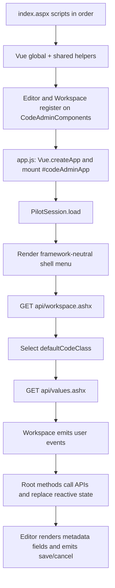
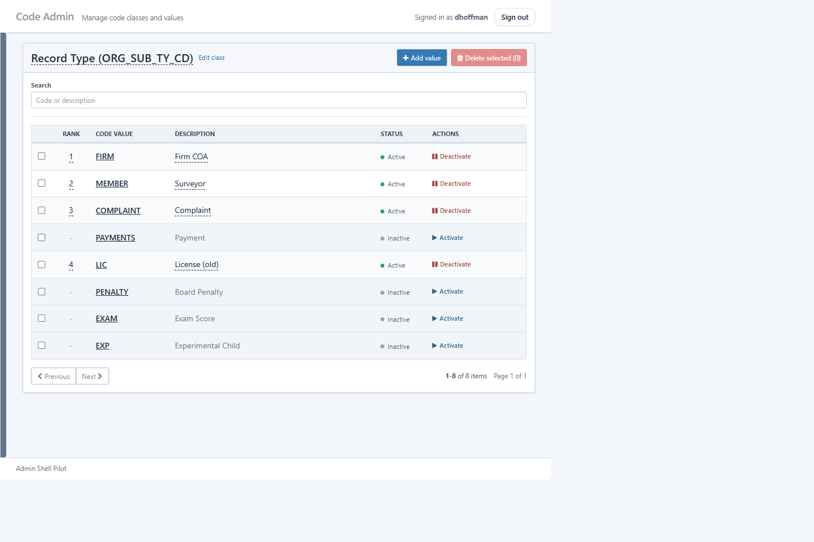
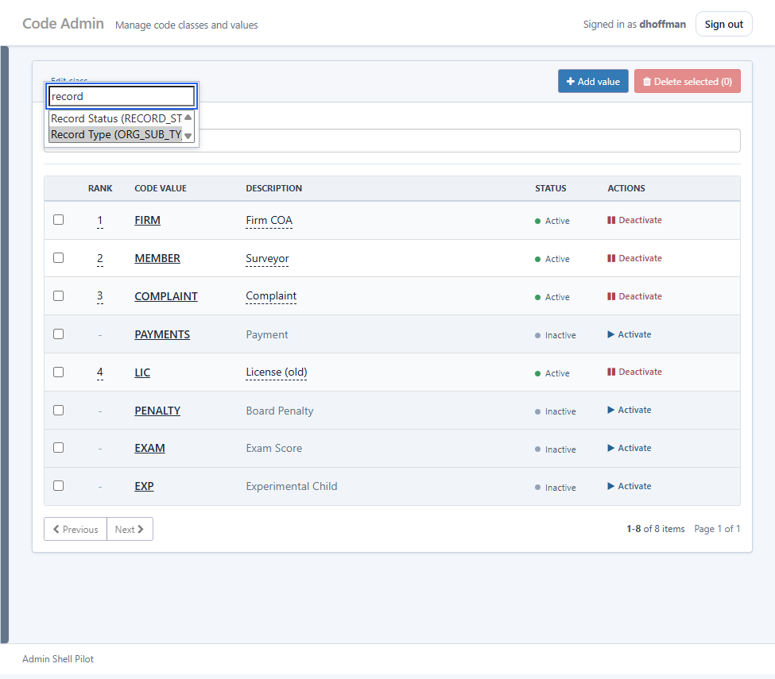
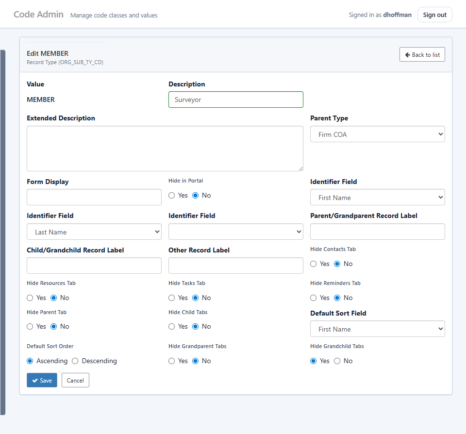
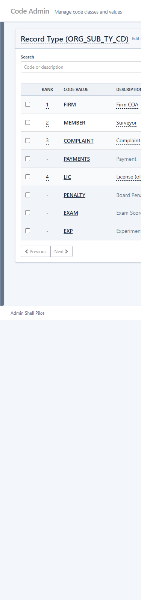

# Zero-Build Vue Managed Screens

This guide is for company developers who know browser JavaScript and are new to
Vue. It documents the managed-screen pattern currently used by Code Admin and
the shared `InlineEdit` component. The shell remains framework-neutral: its
session, navigation, logout, and chrome code are ordinary browser JavaScript.

Code Admin is the reference implementation. It is currently the managed screen
using this Vue pattern. It is deliberately conservative: Vue **3.5.13's pinned
local global production build** runs ordinary browser JavaScript files directly.
There is no npm install, Vite project, Single File Component (SFC), TypeScript,
or build step.

## Mental Model

Vue owns the DOM below the mount point, which is `#codeAdminApp` in
[`managed/code-admin/index.aspx`](../managed/code-admin/index.aspx). For a
JavaScript developer, the practical mapping is:

| Familiar idea | Vue here |
|---|---|
| Mutable screen state | `data()` returns reactive state. Changing `this.search` or `this.page` updates the matching DOM. |
| A value calculated from state | `computed`, such as `hasSelectedClass`. |
| Event handler or API operation | `methods`, including `async` methods. |
| Parent-to-child input | A component `prop`, written with `:prop-name="value"`. |
| Child-to-parent notification | A child `$emit("event-name", value)` and parent `@event-name="handler"`. |
| Conditional markup | `v-if` / `v-else-if` / `v-else`. |
| Loop | `v-for`, always with a stable `:key`. |
| Form value wiring | `v-model`. |
| Click handler | `@click`. |
| Attribute/property binding | `:disabled`, `:aria-label`, `:class`, and similar bindings. |

Vue reconciles and updates the DOM after state changes. Inside a Vue-owned
screen, do not assign `root.innerHTML`, attach delegated root event listeners,
or manually mutate elements rendered by Vue. Update reactive state instead.
It is fine for the framework-neutral shell to use ordinary DOM APIs outside
`#codeAdminApp`.

## File Map And Load Order

The current Code Admin screen uses these files:

| File | Responsibility |
|---|---|
| [`managed/code-admin/index.aspx`](../managed/code-admin/index.aspx) | Server-authenticated page, CSS and script order, and the `#codeAdminApp` mount element. |
| [`managed/shared/vendor/vue.global.prod.js`](../managed/shared/vendor/vue.global.prod.js) | Pinned local Vue 3.5.13 global production build. |
| [`managed/shared/inline-edit.js`](../managed/shared/inline-edit.js) and [`managed/shared/inline-edit.css`](../managed/shared/inline-edit.css) | Reusable Vue inline editor and its scoped shared styling. |
| [`managed/code-admin/js/view-model.js`](../managed/code-admin/js/view-model.js) | Pure helpers for metadata ordering, payload fields, and page defaults. |
| [`managed/code-admin/js/navigation.js`](../managed/code-admin/js/navigation.js) | Pure URL parsing/building and browser-title helpers for Code Admin list and detail state. |
| [`managed/code-admin/js/components/editor.js`](../managed/code-admin/js/components/editor.js) | The full detail editor component. |
| [`managed/code-admin/js/components/workspace.js`](../managed/code-admin/js/components/workspace.js) | Class selector, list, rank edit, actions, and pager component. |
| [`managed/code-admin/js/app.js`](../managed/code-admin/js/app.js) | Root app state, API workflow, component registration, mount, and bootstrap. |
| [`managed/code-admin/code-admin.css`](../managed/code-admin/code-admin.css) | Code Admin-specific CSS scoped beneath `#codeAdminApp`. |

`index.aspx` loads shared API/session/dialog/shell files first, then Vue,
InlineEdit, the view-model and navigation helpers, `editor.js`, `workspace.js`, and finally
`app.js`. This is dependency order: each later file can use globals established
by earlier files. The current query-string versions are cache keys, so update
the key for every changed static JS or CSS file.

The relevant checks live in
[`managed/App_Data/tests/CodeAdminInlineEditTests.js`](../managed/App_Data/tests/CodeAdminInlineEditTests.js),
[`managed/App_Data/tests/CodeAdminViewModelTests.js`](../managed/App_Data/tests/CodeAdminViewModelTests.js),
[`managed/App_Data/tests/CodeAdminWorkspaceUiTests.js`](../managed/App_Data/tests/CodeAdminWorkspaceUiTests.js),
and [`managed/App_Data/tests/PilotShellUiTests.js`](../managed/App_Data/tests/PilotShellUiTests.js).

## Startup And Data Flow

`app.js` creates the root application, supplies the component registry, registers
the shared `InlineEdit` component, and mounts once at `#codeAdminApp`. Its
`bootstrap()` function configures and loads the session, fills the signed-in user
label, renders the shell menu, then loads the Code Admin workspace. Before choosing
the server default, it parses the query string. A valid `codeClass` selects that
class; an invalid or missing class falls back to the server default and normalizes
the location with `history.replaceState`. The values API supplies the current
200-row list.

List state uses `index.aspx?codeClass=<CODE>` and detail state uses
`index.aspx?codeClass=<CODE>&codeValue=<VALUE>&id=<numeric id>`. The value is
readable context; `id` remains the stable API key. Successful class changes push
the list URL and set `<Friendly Class> - Code Admin`; successful detail loads push
the detail URL and set `Edit <CODE VALUE> - <Friendly Class> - Code Admin`.
`popstate` restores list/detail state without a full navigation. Direct details
first load the workspace/list, then validate the loaded record against the class
and value in the route before showing it.



Children do not make decisions about root workflow. `Workspace` receives state
and callback props, then emits selection, search, navigation, and action events.
`Editor` receives the current editor record and emits save/cancel and metadata
refresh requests. Root methods retain API error handling and request-generation
checks so a late response cannot replace current state.

### Inline class and description edits

The selected class is the workspace title and opens a searchable `InlineEdit`
selector. The filter matches labels and values case-insensitively, focuses on
open, and presents a bounded native listbox with an empty state. Selecting a
class commits immediately; Escape restores the prior class without a request.
The filter and listbox are a single composite focus region, so moving between
them cannot accidentally blur-save. The adjacent `Edit class` link opens the
legacy class administration page in the same tab.

Active, non-protected list rows render their description with text `InlineEdit`.
Its blur/Enter/Escape/pending/error behavior is shared. A description save first
GETs the complete record by ID, verifies its class and value still match the
current row, builds the same complete metadata payload used by the detail editor,
changes only `codeValueDesc`, and POSTs `action=update`. Multi-select arrays are
serialized as `", "`; this avoids clearing optional fields with a partial update.

## Real Code Patterns

### Plain JavaScript component

Components are ordinary IIFEs that put a plain object on a shared registry. This
shortened example is the current shape of `Editor`:

```js
(function (global) {
    global.CodeAdminComponents = global.CodeAdminComponents || {};
    global.CodeAdminComponents.Editor = {
        props: {
            editor: { type: Object, required: true },
            selectedClass: { type: String, required: true },
            workspace: { type: Object, required: true }
        },
        computed: {
            detailFields: function () {
                return global.CodeAdminViewModel.getDetailFields(
                    { fieldMetadata: { [this.selectedClass]: this.editor.fieldMetadata } },
                    this.selectedClass
                );
            }
        },
        template: `
            <section class="editor-panel">
                <form @submit.prevent="$emit('save')">
                    <div v-for="field in detailFields" :key="field.key">
                        {{ field.label }}
                    </div>
                </form>
            </section>`
    };
}(window));
```

The multiline template is still HTML, but Vue interprets its directives. Put
the component file before `app.js` in `index.aspx`; `app.js` passes
`global.CodeAdminComponents` to `Vue.createApp`.

### Root state, computed state, and an API request

This shortened excerpt from [`app.js`](../managed/code-admin/js/app.js) shows
the root pattern. `loadSequence` is a module-level generation token. Only the
latest list response may update the screen or surface its error.

```js
const app = global.Vue.createApp({
    components: global.CodeAdminComponents,
    data: function () {
        return {
            workspace: { classes: [] },
            page: viewModel.emptyPage(),
            selectedClass: "", search: "", start: 0,
            loading: false, selectedIds: {}, editor: null,
            rankUpdating: false, message: ""
        };
    },
    computed: {
        hasSelectedClass: function () {
            return viewModel.hasSelectedClass(this.selectedClass);
        }
    },
    methods: {
        handleError: function (error) {
            this.message = (error && error.message) || "The request could not be completed.";
        },
        loadValues: async function () {
            const requestSequence = ++loadSequence;
            if (!this.hasSelectedClass) {
                this.page = viewModel.emptyPage();
                this.loading = false;
                return;
            }
            this.loading = true;
            try {
                const page = await global.PilotApiClient.get(
                    "api/values.ashx?codeClass=" + encodeURIComponent(this.selectedClass) +
                    "&search=" + encodeURIComponent(this.search || "") +
                    "&start=" + encodeURIComponent(this.start)
                );
                if (requestSequence === loadSequence) {
                    this.page = page;
                    this.loading = false;
                    this.message = "";
                }
            } catch (error) {
                if (requestSequence === loadSequence) {
                    this.loading = false;
                    throw error;
                }
            }
        }
    }
});
```

Keep this error propagation shape: event handlers call async methods with
`.catch(handleError)`, while the async method rethrows a current request's
failure. For editor loads, use `invalidateEditorRequests()` and compare both
the request sequence and current class before replacing `this.editor`. For a
class change, preserve and restore the prior root state only when the current
class-load request fails, as `selectClass` already does.

### Props down, events up

The root renders the child components using props and event listeners:

```html
<Editor v-if="editor"
        :editor="editor"
        :selected-class="selectedClass"
        :workspace="workspace"
        @cancel="cancelEditor"
        @save="function () { saveEditor().catch(handleError); }">
</Editor>

<Workspace v-else
           :workspace="workspace"
           :page="page"
           :selected-class="selectedClass"
           :search="search"
           :on-class-change="selectClass"
           :on-save-rank="saveRank"
           @search-change="onSearchInput"
           @selection-change="toggleSelected"
           @edit="function (id) { openEditEditor(id).catch(handleError); }">
</Workspace>
```

In `Workspace`, a user event stays small and explicit:

```html
<input :value="search"
       type="search"
       @input="$emit('search-change', $event.target.value)">

<button type="button" @click="$emit('edit', item.codeValueId)">
    {{ item.codeValue }}
</button>
```

### Metadata-driven fields

Do not hardcode organization or class-specific labels, options, requirements,
or controls in the editor. `detailFields` comes from API metadata and the
current editor chooses its control from `field.controlType`:

```html
<div v-for="field in detailFields" :key="field.key" class="form-group">
    <label v-if="field.controlType !== 'radio'"
           class="control-label"
           :for="'detail-' + field.key">{{ field.label }}</label>

    <textarea v-if="field.controlType === 'textarea'"
              :id="'detail-' + field.key"
              v-model="editor[field.key]"
              class="form-control" rows="4" :required="field.required"></textarea>

    <select v-else-if="field.controlType === 'select' || field.controlType === 'multiselect'"
            :id="'detail-' + field.key"
            v-model="editor[field.key]"
            class="form-control"
            :multiple="field.controlType === 'multiselect'"
            :required="field.required">
        <option v-for="option in field.options" :key="option.value" :value="option.value">
            {{ option.label }}
        </option>
    </select>

    <input v-else :id="'detail-' + field.key" v-model="editor[field.key]"
           class="form-control" :required="field.required">
</div>
```

`saveEditor` gets its field keys from `getPayloadFieldKeys`; it joins
multi-select arrays as `", "`. Preserve that behavior rather than inventing
a class-specific payload.

## Common Changes

### Change list markup or add a column

Edit [`managed/code-admin/js/components/workspace.js`](../managed/code-admin/js/components/workspace.js).
Update both the header and `v-for` row, use existing item fields from the list
API, and keep responsive table markup (`table-responsive`) so mobile users can
scroll horizontally instead of losing columns. Add a focused assertion to
[`CodeAdminWorkspaceUiTests.js`](../managed/App_Data/tests/CodeAdminWorkspaceUiTests.js)
when the source contract changes. Bump the `workspace.js?v=...` cache key in
[`index.aspx`](../managed/code-admin/index.aspx).

### Add root state or a derived value

Edit [`app.js`](../managed/code-admin/js/app.js). Add actual mutable state to
the object returned by `data()` and add a `computed` member when it can be
derived from existing state. Do not store the same fact twice. Pass state to a
child as a prop and let the child emit an event if it needs a root transition.
Add a source-contract test when behavior depends on the new root workflow.

### Add or change an API-backed action

Put the workflow method in `app.js`, use `global.PilotApiClient.get` or `.post`,
and call it through an event wrapper that catches with `handleError`.

```js
setActive: async function (item, action) {
    await global.PilotApiClient.post("api/values.ashx?action=" + action, {
        codeClass: item.codeClass,
        codeValue: item.codeValue
    });
    await this.loadValues();
}
```

For an operation affected by class/search/editor changes, add the appropriate
request-generation guard before changing state. Do not remove a current
`try`/`catch`, `finally`, or request token merely because the happy path works.
Preserve the API's current request and response contract unless its server-side
owner is deliberately changing it.

### Change editor metadata rendering

Edit [`editor.js`](../managed/code-admin/js/components/editor.js) and, if the
change is a pure metadata rule, [`view-model.js`](../managed/code-admin/js/view-model.js).
Continue to render `field.label`, `field.options`, `field.required`, and
`field.controlType` from `detailFields`. The API owns organization/class
metadata. Do not add organization IDs, class names, labels, or lookup values to
the JavaScript template.

### Use InlineEdit in another managed Vue screen

Load [`inline-edit.js`](../managed/shared/inline-edit.js) and its CSS before
the screen component files, then register it once after `createApp`:

```js
app.component("InlineEdit", global.InlineEdit);
```

Use a neutral accessible label and return the save promise. Route errors to the
screen's existing error state.

```html
<InlineEdit editor-type="select"
            :value="selectedClass"
            editor-id="codeClassSelect"
            :options="classOptions"
            label="Code class"
            :on-save="changeClass"
            :on-error="handleError"></InlineEdit>

<InlineEdit editor-type="number"
            :value="item.orderBy || ''"
            :label="'Rank for ' + item.codeValue"
            placeholder="Set"
            :on-save="function (value) { return saveRank(item, value); }"
            :on-error="handleError"></InlineEdit>
```

The class selector is the select example; the rank control is the number
example. Ensure the save function validates input, returns the API promise, and
reloads or replaces reactive state after success. Avoid `editor-id` duplication;
the ID labels the editable input/select, while `label` always supplies an
accessible name for the trigger and editor.

### Add another plain JavaScript Vue component

Create a component file that adds `global.CodeAdminComponents.ComponentName`.
Place it after its helper dependencies and before `app.js` in `index.aspx`.
Use it through the root registry or explicitly register it. Add or update a
focused Node source-contract test and bump the changed file's query-string cache
key. No package install or build output is needed.

### Change styling

Keep Code Admin CSS in
[`managed/code-admin/code-admin.css`](../managed/code-admin/code-admin.css),
under `#codeAdminApp`, and retain the page's Bootstrap 3.4.1 and existing
legacy stylesheet order. Shared InlineEdit behavior/style belongs in its shared
files only when the change is genuinely reusable. Do not add Bootstrap 5,
Bootstrap JavaScript, or global selector overrides for a Code Admin change.

## InlineEdit Contract

`InlineEdit` has a dashed display trigger. Selecting it replaces the trigger
with either an input, a number input, or a select editor. A changed value commits
on blur or Enter. Escape restores the original value and suppresses the blur
that follows it. While a save is pending it displays `Saving`, disables editing,
and prevents duplicate commits. A failed asynchronous save rolls the displayed
value back to the original and calls `onError`.

Only one inline editor captures Escape at a time. The select uses a bounded
two-to-eight-row in-page listbox positioned near the trigger. It is not a
separate popup or modal: it remains part of the page's DOM and receives the same
label, focus, Escape capture, blur, and pending-state rules. Use `editor-id`
where a visible `<label for="...">` needs an editor ID; always supply `label`
for accessible trigger/editor naming.

## Tests And Browser Checks

From `E:\web\repos\admin-new`, run the current JavaScript checks exactly:

```powershell
node managed\App_Data\tests\CodeAdminInlineEditTests.js
node managed\App_Data\tests\CodeAdminViewModelTests.js
node managed\App_Data\tests\CodeAdminWorkspaceUiTests.js
node managed\App_Data\tests\PilotShellUiTests.js
```

These are plain Node tests. The view-model test covers pure helper behavior;
the workspace and shell tests are source-contract/controller tests that protect
script order, component ownership, templates, request guards, and integration
points; the InlineEdit test covers controller behavior and synthetic DOM capture
behavior. They do not replace a deployed-browser verification.

Test the deployed page through the remote development URL after a UI change:

- Change a class through InlineEdit, blur, and confirm one persisted request.
- Begin a class edit, press Escape, and confirm no save request occurs.
- Change a rank, including invalid rank handling and refresh after a valid save.
- Search quickly and confirm the final term/list wins over stale responses.
- Open a value and use Back to confirm the filtered list returns.
- At mobile width, confirm the menu opens/closes and the table retains columns
  with horizontal overflow rather than collapsing data.

Do not claim that physical native-select Escape behavior was verified by
Playwright. The component's capture behavior is covered by tests and synthetic
DOM behavior; integrated-browser native keyboard events can be swallowed.

## Deployment

There is no build. The source of truth is `E:\web\repos\admin-new`; do not
edit `A:\GLOBAL_6-next\admin`.

1. Edit and test files in the repository.
2. Bump query-string cache keys for changed static assets in
   [`managed/code-admin/index.aspx`](../managed/code-admin/index.aspx).
3. Copy exactly the changed UI files to
   `A:\wvbps\www\html\dev\adminshell\managed\code-admin\` (or the matching
   `managed\shared\` mapped deployment directory for shared assets).
4. Copy changed Code Admin VB.NET files, when applicable, to
    `A:\wvbps\www\html\App_Code\AdminShell\CodeAdmin\`.
5. Hash-compare the repository and deployed copies, then reload and browser-test
   the remote development page. App_Code changes require the deployed ASP.NET
   application to recompile/recycle as appropriate.

Do not make edits directly in the mapped deployment path, and never edit the
read-only global admin tree.

## Debugging

Start with the browser console and Network panel. A missing global, an
unexpected template text node, or a Vue warning usually points to script order,
a stale cached asset, or invalid template markup. Confirm the local Vue script
loaded before components and that the component files loaded before `app.js`.

For a data problem, inspect the document-relative API request, status, and JSON
body. Check that encoded `codeClass`, search text, and IDs match the current
root state. For a late response issue, inspect the relevant `loadSequence`,
`editorRequestSequence`, or `classChangeSequence` check before changing state.
For a DOM problem, remove direct DOM mutations from the Vue root and express the
desired state through `data`, `computed`, props, and events.

## Screenshots



*The list workspace: fixed-page values remain in a responsive table.*



*The shared InlineEdit class selector uses the bounded in-page select listbox.*



*The detail editor renders fields supplied by metadata rather than hardcoded class data.*



*On mobile, the shell menu adapts and the data table uses horizontal overflow rather than collapsing columns.*

## Decision Record And Guardrails

This adoption intentionally avoids npm, Vite, and Tailwind. The existing
deployment model copies browser assets directly to IIS paths, and ordinary JS
files are maintainable by the team without a frontend toolchain. Bootstrap 3
remains because Code Admin intentionally matches the compact established admin
controls and existing page styling.

The tradeoff is explicit: zero-build Vue does not provide SFCs, TypeScript,
tree-shaking, or Vue Test Utils. It still provides reactive state, components,
declarative templates, and focused Node/browser checks. This is a local managed
screen pattern, not a directive to migrate unrelated legacy or jQuery screens.

Before finishing a change:

- Use neutral names; do not introduce a new `Pilot` prefix.
- Do not add npm dependencies or build artifacts without an explicit team decision.
- Preserve API contracts and current server-side authorization/validation.
- Add or update focused tests before relying on browser verification.
- Bump every changed static asset's cache key in `index.aspx`.
- Preserve labels, IDs, keyboard behavior, focus, and responsive overflow.
- Keep organization/class metadata dynamic; do not hardcode labels, options, or lookup data.