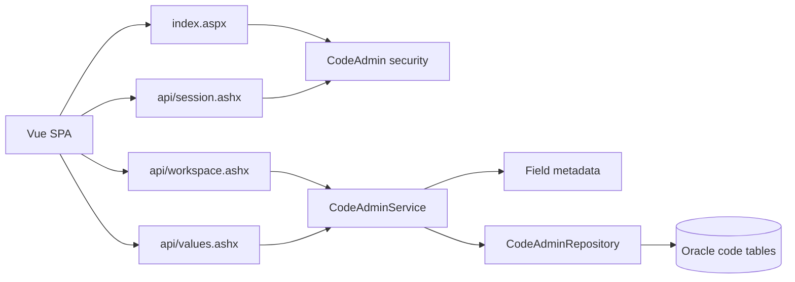

# Code Admin architecture

Code Admin is a Vue single-page application backed by narrow VB.NET JSON APIs.
It replaces the legacy Oracle-backed `cgi-bin/codeadminO.pl` and
`cgi-bin/codeadmin.pl` workflows while preserving their canonical access rules,
field metadata, protected values, and organization-specific behavior.

## Runtime shape



The browser owns presentation, navigation state, inline editing, and API
coordination. The server remains authoritative for authentication,
authorization, CSRF validation, input validation, lookup membership, protected
records, transaction boundaries, and Oracle persistence.

## Browser application

| Path | Responsibility |
| --- | --- |
| `index.aspx` | Authenticated managed-shell host and Vue mount point. |
| `code-admin.css` | Tool-specific styling scoped beneath `#codeAdminApp`. |
| `js/app.js` | Root application state, API workflow, and bootstrap. |
| `js/view-model.js` | Pure metadata, payload, and paging helpers. |
| `js/navigation.js` | Directory URL parsing, history, and document titles. |
| `js/components/workspace.js` | Class selector, list, search, paging, and inline actions. |
| `js/components/editor.js` | Create and detail editor. |
| `api/session.ashx` | Shared session, menu, CSRF, and shell data. |
| `api/workspace.ashx` | Editable classes and field metadata. |
| `api/values.ashx` | Value reads and all mutations. |

The `.aspx` and `.ashx` files are intentionally thin directives. Their server
classes are compiled by the parent ASP.NET application from
`App_Code/AdminShell/CodeAdmin`.

## Server application

Code Admin has seven production VB files:

| File | Responsibility |
| --- | --- |
| `CodeAdminContracts.vb` | DTOs, commands, shared option-value mapping, mutation context, and repository contract. |
| `CodeAdminRules.vb` | Constants, validation, protected-class rules, and lifecycle rules. |
| `CodeAdminSecurity.vb` | Route access, host/session checks, and CSRF guards. |
| `CodeAdminApiHandlers.vb` | Page host, HTTP handlers, request dispatch, and JSON serialization. |
| `CodeAdminFieldMetadata.vb` | Default and organization/class-specific field definitions and lookup sources. |
| `CodeAdminService.vb` | Business orchestration, authorization-sensitive rules, lookup validation, and metadata hydration. |
| `CodeAdminRepository.vb` | Parameterized Oracle queries, persistence, ordering, lifecycle updates, and transactions. |

The layer direction is:

```text
HTTP handlers -> security/service -> rules/metadata/contracts -> repository -> Oracle
```

Handlers do not issue SQL. The repository does not decide whether a user may
open the tool. The service owns application behavior and depends on
`ICodeAdminRepository`, allowing service tests to use an in-memory fake.

## Why the files are in App_Code

This site is an ASP.NET **Web Site**, not a compiled Web Application project.
`/dev/adminshell/managed` is an ordinary folder inside the parent application,
not its own IIS application. In this hosting model, application-root `App_Code`
is the automatic source-compilation boundary.

`App_Code` is therefore not limited to libraries shared by many tools. It is the
parent application's server-code unit. The Code Admin handlers currently depend
on shared identity, configuration, access, JSON, managed-page, and exception
types compiled there.

Simply moving the seven files beside `index.aspx` would not compile the service
and repository. Adding `CodeFile` can compile an individual page or handler,
but it does not establish a reusable tool-local service assembly. Pointing
multiple endpoints at the same loose source would duplicate compilation rather
than create a clean boundary. A nested `managed/code-admin/App_Code` is not an
application compilation folder and must not be introduced.

Keep shared admin-shell source under application-root `App_Code/AdminShell` and
the seven Code Admin files under `App_Code/AdminShell/CodeAdmin` while the site
remains a Web Site. Application-root `App_Code` is the special compilation
root: under the current default configuration, ordinary same-language nested
folders participate in its generated assembly. Explicit `codeSubDirectories`
entries would create separate compilation units. This is a hosting constraint,
not a claim that Code Admin is a cross-tool library.

## Future compiled-library boundary

If stricter physical ownership becomes worthwhile, migrate to compiled
assemblies in this order:

1. Create an `AdminShell.Platform` project for the shared identity,
   configuration, managed-shell, JSON, access, and exception contracts now
   compiled from `App_Code`.
2. Deploy that project as a versioned assembly under application-root `bin`.
3. Create a `CodeAdmin` project referencing `AdminShell.Platform`; move the seven
   Code Admin source files into that project.
4. Keep the `.aspx` and `.ashx` directives in this folder, backed by types from
   the compiled `CodeAdmin` assembly.
5. Remove the corresponding loose `App_Code` source only after full-site compile,
   authentication, API, Oracle, and rollback verification.

A `bin` assembly cannot cleanly reference types from the dynamically generated
App_Code assembly, so moving Code Admin first would invert the supported
assembly dependency direction. Making Code Admin a separate IIS application is
another possible boundary, but it would also require explicit configuration for
authentication, session, connection strings, routes, and shared shell behavior;
it is not a source-file cleanup.

## Request and security flow

1. `CodeAdminPage` verifies the configured host, managed session, and canonical
   Code Admin route before serving the SPA.
2. `ManagedShell.initialize` loads session and access-filtered menu data.
3. API handlers reject unsupported HTTP methods.
4. `CodeAdminApiGuard` enforces host, authenticated user, and Code Admin access.
5. Mutations additionally require the session-bound CSRF token.
6. `CodeAdminService` validates the command, editable class, lookup membership,
   protected values, and lifecycle constraints.
7. `CodeAdminRepository` executes parameterized Oracle commands.
8. The shared JSON layer returns the standard `{ "ok": true, "data": ... }`
  envelope or maps service exceptions to the appropriate HTTP response.

Both legacy script identities map to the managed tool, while direct managed
access uses the `codeadminO.pl` canonical ACL identity.

## Data and transaction behavior

- Code Admin uses the Oracle `ConnectionString`, matching the legacy Perl tool.
- `CodeAdminMajorCode` supplies the organization identifier where configured.
- The repository persists `option_value_1` through `option_value_17` and
  `form_display`.
- `CodeAdminFieldMetadataRegistry` determines labels, controls, required fields,
  and server-owned lookup sources.
- Submitted lookup values are checked against server-loaded options.
- Multiselect values normalize to the legacy comma-space storage format.
- `CodeAdminMutationContext` explicitly tells the repository when a mutation
  must rebuild the organization 3900 `LicenseObjType` derived tables.
- Create, update, delete, and derived-table rebuilding remain in one Oracle
  transaction for that special case.

## Validation

From the repository root, run all managed JavaScript tests:

```powershell
$tests = @(rg --files managed/App_Data/tests -g '*Tests.js' | Sort-Object)
foreach ($test in $tests) {
    node $test
    if ($LASTEXITCODE -ne 0) { exit $LASTEXITCODE }
}
```

The focused VB suites compile with the .NET Framework compiler:

```powershell
$compiler = 'C:\Windows\Microsoft.NET\Framework64\v4.0.30319\vbc.exe'

& $compiler /nologo /define:CODE_ADMIN_TEST /target:exe `
    /out:$env:TEMP\CodeAdminValidationTests.exe `
    /reference:System.dll `
    managed\App_Data\tests\CodeAdminValidationTests.vb `
    App_Code\AdminShell\AdminShellExceptions.vb `
    App_Code\AdminShell\CodeAdmin\CodeAdminRules.vb
& $env:TEMP\CodeAdminValidationTests.exe

& $compiler /nologo /define:CODE_ADMIN_TEST /target:exe `
    /out:$env:TEMP\CodeAdminServiceTests.exe `
    /reference:System.dll,System.Core.dll,System.Configuration.dll,System.Data.dll `
    managed\App_Data\tests\CodeAdminServiceTests.vb `
    App_Code\AdminShell\AdminShellExceptions.vb `
    App_Code\AdminShell\AdminShellData.vb `
    App_Code\AdminShell\CodeAdmin\CodeAdminContracts.vb `
    App_Code\AdminShell\CodeAdmin\CodeAdminFieldMetadata.vb `
    App_Code\AdminShell\CodeAdmin\CodeAdminRepository.vb `
    App_Code\AdminShell\CodeAdmin\CodeAdminRules.vb `
    App_Code\AdminShell\CodeAdmin\CodeAdminService.vb
& $env:TEMP\CodeAdminServiceTests.exe
```

For a backend change, also compile the complete `App_Code/AdminShell` source set
and verify the authenticated remote page plus `api/workspace.ashx` and
`api/values.ashx`.

## Deployment

Repository source of truth:

```text
E:\web\repos\admin-new
```

WVBPS development deployment:

| Source | Destination |
| --- | --- |
| `managed/code-admin/` | `A:\wvbps\www\html\dev\adminshell\managed\code-admin\` |
| `App_Code/AdminShell/CodeAdmin/CodeAdmin*.vb` | `A:\wvbps\www\html\App_Code\AdminShell\CodeAdmin\` |

Before changing deployed App_Code, confirm
`A:\wvbps\www\html\App_Code\.history` does not exist. Replace the Code Admin
file set as one coordinated operation, remove retired source files, and verify
source/deployment SHA-256 parity. App_Code changes trigger parent-application
recompilation, so validate through the remote development URL after deployment.

Never edit the global legacy admin source under `GLOBAL_6-next/admin`.
